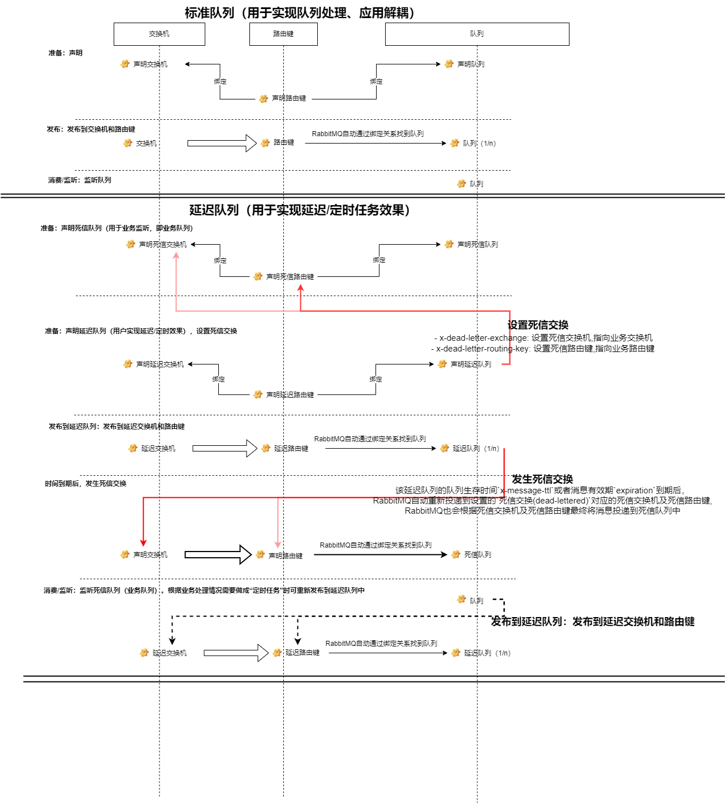

# RabbitMQ 消息队列

> 参考

https://www.rabbitmq.com/getstarted.html
https://www.rabbitmq.com/documentation.html

## 消息队列类型

### 简单队列（一次向一个消费者发送消息）
- 同`工作队列`的消息队列类型基本一致，也是多个消费者竞争模式，只是`工作队列`我们一般持久化队列和持久化消息
- 无交换机类型

阅读文档：
https://www.rabbitmq.com/tutorials/tutorial-one-go.html

测试文件及方法：
publish_app_test.go@TestRabbitMQClient_PublishSimple,
consume_app_test.go@TestRabbitMQClient_ConsumeSimple、@TestRabbitMQClient_ConsumeSimple01


### 工作队列（竞争消费者模式）
- 工作队列（又名：任务队列）背后的主要思想是避免立即执行资源密集型任务而不得不等待它完成。相反，我们将任务安排在以后完成，用于在多个消费者之间分配耗时的任务。
- 无交换机类型

阅读文档：
- https://www.rabbitmq.com/tutorials/tutorial-two-go.html

测试文件及方法：
- publish_app_test.go@TestRabbitMQClient_PublishWork,
- consume_app_test.go@TestRabbitMQClient_ConsumeWork、@TestRabbitMQClient_ConsumeWork01

### 发布和订阅队列（一次向多个消费者发送消息）
- 交换机类型=fanout

阅读文档：
- https://www.rabbitmq.com/tutorials/tutorial-three-go.html

测试文件及方法：
- publish_app_test.go@TestRabbitMQClient_PublishFanout
- consume_app_test.go@TestRabbitMQClient_ConsumeFanout、@TestRabbitMQClient_ConsumeFanout01

### 路由队列（有选择地接收消息）
- 相对于`发布和订阅队列`的消息类型，路由队列（有选择地接收消息）可以仅订阅消息的子集
- 交换机类型=direct：direct(直接)交换机类型是fanout(扇出)交换机类型的升级类型，direct(直接)交换机类型背后的路由算法很简单：消息进入绑定键RoutingKey与消息的路由键完全匹配的队列

阅读文档：
- https://www.rabbitmq.com/tutorials/tutorial-four-go.html

测试文件及方法：
- publish_app_test.go@TestRabbitMQClient_PublishDirect, @TestRabbitMQClient_PublishDirect01
- consume_app_test.go@TestRabbitMQClient_ConsumeDirect、@TestRabbitMQClient_ConsumeDirect01


### 主题队列（基于模式（主题）接收消息 ）
- 相对于`路由队列（有选择地接收消息）`的消息类型，主题队列（基于模式（主题）接收消息 ）基于多个标准进行路由
- 交换机类型=topic：topic(主题)交换机类型是direct(直接)交换机类型的升级类型


阅读文档：
- https://www.rabbitmq.com/tutorials/tutorial-five-go.html

测试文件及方法：
- publish_app_test.go@TestRabbitMQClient_ConsumeDirect, @TestRabbitMQClient_PublishTopic
- consume_app_test.go@TestRabbitMQClient_ConsumeTopic、@TestRabbitMQClient_ConsumeTopic00、、@TestRabbitMQClient_ConsumeTopic01、、@TestRabbitMQClient_ConsumeTopic02、


### RPC队列（请求/回复模式）
// TODO: 未找到相应的应用场景：不紧急，不重要 - prince@todo 2022/5/18 上午1:24

## 关于生产者与消费者
- 非自动确认（autoAck=false）的消息
    - 确认消息：消费者接收消息，并在处理完业务逻辑后确认消息(ack(true/false))告诉RabbitMQ已正确接收RabbitMQ会安全的把消息从队列上删除。
    - 拒绝接收: 可以使用reject命令拒绝接收消息，参数为 true，会发送给下一个消费者，false 时，会把消息从队列中移除不会分发给下一个消费者
        - reject(true):重新回到队列，会发送给下一个消费者
        - reject(false):会把消息从队列中移除（或者进入死信队列）不会分发给下一个消费者
    - 发生异常或者长时间堵塞：消费者接收消息后，一直没有确认消息
      - 可能的原因是发生异常或者长时间堵塞，那么当channel(渠道)关闭时会自动回到队列中。
      - 即**非自动确认（autoAck=false）的消息**, 对于`消费者接收消息后，一直没有确认消息`则会自动会到对列中

- 确保即使消费者死亡，任务没有丢失
    - 如果消费者收到一条消息，在确认之前，如果消费者死亡（其通道关闭，连接关闭，或TCP连接丢失）不发送 ack，RabbitMQ 将定义消息为未完全处理并将重新排队。 如果同时有其他消费者在线，它会快速重新发送 给另一个消费者。 这样您就可以确保不会丢失任何消息， 即使工人偶尔死亡。
    - 对消费者在超时（默认为30分钟）后强制执行交付确认。 这有助于检测从不确认交付的错误（卡住）消费者。 您可以按照中所述增加此交货确认超时时间。

- 虽确保即使消费者死亡，任务没有丢失。但是RabbitMQ服务器停止（奔溃、重启、意外退出），任务仍然不会丢失。如何确保RabbitMQ服务器停止时，确保消息不会丢失，需要做两件事
    - 队列持久化：声明队列持久化（durable=true）。确保RabbitMQ服务器停止，队列不会丢失。
    - 消息持久化：设置 amqp.Publishing 的 DeliveryMode=amqp.Persistent。确保RabbitMQ 服务器停止，消息不会丢失。
    > 注意：RabbitMQ 不允许您重新定义现有队列具有不同的参数，并将向任何程序返回错误，阻止重新定义现有队列具有不同的参数。

- Qos 公平调度机制
    - channel.Qos 控制服务器在接收传递确认之前，将尝试在网络上为消费者保留多少消息或多少字节（换句话说：在消费者未确认前为消费者最多保留多少条消息或多少字节）。Qos的目的是确保服务器和客户端之间的网络缓冲区保持完整。

## 关于队列（声明队列） 
- 创建的队列名同时，如果不指定 routingKey,则默认routingKey等于队列名，并且被默认交换机所绑定。
    - 注意：程序中就算队列名等于routingKey，也应显式的指定该routingKey等于队列名，否则消息到达默认交换机后因无法找到队列名而丢弃该消息。
- 通过命令或者API声明一个空的队列名时，RabbitMQ会自动创建一个随机命名的队列名。
    - 对于交换机类型=fanout（发布和订阅）或者=direct(直接)的交换机类型的消息队列类型来说，建立一个空的队列名是有用的，因为它无需关注旧的消息。
    - 交换机需要绑定由RabbitMQ自动创建一个随机命名的队列名时，应在声明队列后返回的 amqp.Queue 中获取随机的队列名进行绑定
- 队列被声明为独占，那么在我们断开消费者的连接时（无消费者连接该声明的队列时），队列会被自动删除
    - 官方说明：https://www.rabbitmq.com/queues.html#exclusive-queues
    - 声明队列时设置为独占队列（长期有效）或者消费时设置队列为独占（临时）都属于独占队列，独占队列只允许当前连接通道操作。
        - 声明队列时设置为独占队列（长期有效）在我们断开消费者的连接时（无消费者连接该声明的队列时），队列会被自动删除。所以通常我们声明独占队列时，我们无需指定确定的队列名（让RabbitMQ自动创建即可）
        - 消费时设置队列为独占（临时）是临时的，我们断开消费者的连接时（无消费者连接该声明的队列时），队列不会被自动删除
    - 如果想拥有私人队列只为一个消费者服务，可以设置 exclusive 参数为 true
    - 与声明队列持久化没有关系
- 队列被声明为自动删除(RabbitMQ管理后台feature=AD).autoDelete=true在消费者取消订阅时，会自动删除。
    - 与声明队列持久化没有关系


> 注意：RabbitMQ 不允许您重新定义现有交换机/队列具有不同的参数，并将向任何程序返回错误，阻止重新定义现有交换机/队列具有不同的参数。

## 绑定键RoutingKey
- 交换机与队列之间的关系建立称为绑定，通过绑定键RoutingKey进行绑定
- 绑定键RoutingKey的含义取决于交换机类型
    - 交换机类型=fanout（发布和订阅）时，会自动忽略RoutingKey的设置（无需 RoutingKey）

## 关于交换机
- 交换机类型：fanout、direct、topic、 headers
    - 对应的消息队列类型（其余的队列类型没有使用交换机类型）
        - fanout：发布和订阅队列. 会自动忽略RoutingKey的设置（无需 RoutingKey）
            - fanout(扇出)交换机类型，它没有给我们太多的灵活性，它只能进行无意识的广播
          - direct：路由队列
            - direct(直接)交换机类型是fanout(扇出)交换机类型的升级类型，direct(直接)交换机类型背后的路由算法很简单—，消息进入绑定键RoutingKey与消息的路由键完全匹配的队列
        - topic：主题队列
            - topic(主题)交换机类型是direct(直接)交换机类型的升级类型
            - RoutingKey绑定键它必须是单词列表，由点（`.`）分隔。这些词可以是任何东西，但通常它们指定与消息相关的一些特征。最多为 255 个字节
            - RoutingKey绑定键也必须采用相同的格式。topic(主题)交换机类型背后的逻辑类似于direct(直接)交换机类型，使用特定路由键发送的消息将被传递到与匹配绑定键绑定的所有队列。 但是RoutingKey绑定键有两个重要的特殊情况：
                - `*`（星号）：可以只替换一个单词。
                - `#` (哈希/散列) ：可以代替零个或多个单词
                - 注意：如果我们违反同一个交换机/队列中已存在RoutingKey的规则（如：之前是有三个点（`.`）分隔的，新增的RoutingKey由四个点分隔），则这些消息不会匹配任何绑定并且会丢失。
            - 主题交换功能强大，可以像其他交换一样运行。
                - 当队列与`#`（哈希/散列）绑定键绑定时 - 无论RoutingKey路由键如何，它都会接收所有消息 - 就像在fanout(扇出)交换机类型中一样。
                - 当绑定中不使用特殊字符`*`（星号）和`#`（哈希/散列）时，主题交换的行为就像direct(直接)交换机类型一样。
        - headers：RPC队列
- 默认交换机隐式绑定到RoutingKey等于队列名的每个队列。无法显式绑定到默认exchange或从默认exchange取消绑定。它也不能被删除。

- 关于删除交换机
- 删除交换机，但是未删除队列队名，则队列名自动绑定被默认交换机+默认路由键绑定；如果使用新的交换机和路由键绑定改队列名，则之前该队列中的消息还是存在且继续保留的（消息只存在与队列中）

- 测试交换机类型=fanout中队列名是否空||是否独占队列测试||路由键是否为空

| 发布队列名是否为空 | 发布是否独占队列 | 消费是否空队列名 | 消费是否独占队列 | 结果<br />1. 【交换机声明、队列声明开启持久化（durable=True）】<br />2. 交换机类型=fanout时，不管发布者或者消费者声明绑定时是否定义路由键（routingKey），都会忽略routingKey的绑定关系！如果声明绑定时定义了routingKey不为空，那么可以在rabbitmq管理后台可以看到这层联系，但是并不影响正常的生产和消费（底层忽略这层关系）。 |
| ------------------ | ---------------- | ---------------- | ---------------- | ------------------------------------------------------------ |
| 0                  | 0                | 0                | 0                | 1. 没有开启消费，但是可以发布成功，并且发布成功后再开启消费与生产相同队列名则还可以继续消费到之前发布成功的消息（适用于：在没有开启消费者前（服务重启过程中）但已经声明了队列，且期望是生产者发布的消息不会丢失，即消费者开始监听队列后仍然可以消费到这期间发布的消息）<br />2. 没有开启消费，但是可以发布成功，并且发布成功后再开启消费与生产不同队列名则不可以消费到之前发布成功的消息。 |
| 1                  | 0                | 1                | 0                | 1. 没有开启消费，但是可以发布成功，并且每次发布都会随机生成队列名且后面发布的消息自动添加到前面已声明的队列中（不管是随机生成的还是指定队列的，只要声明时间早于当前队列名则会自动添加），且后面发布的消息不会包含前面已经发布的消息。不过这样虽然发布都是成功的且rabbitmq后台可以看到已存在消息，但是如果这时候去开启消费者是没能消费到之前发布成功的消息（因为发布的时候生成的队列名是随机的，消费没办法找到这个队列名进行消费），不过后面生产者再发布消息这个消费者是可以正常消费的。<br />2. 因为不是独占队列，所以不管是发布者或者消费者在连接断开后，随机生成的队列名仍然还存在的。 |
| 1                  | 1                | 1                | 1                | 1. 没有开启消费，但是可以发布（已实现自动声明交换机、队列名、绑定关系--下同）成功，不过发布成功后队列名自动删除（跟独占队列=True有关系）<br />2. 先开启消费（已实现自动声明交换机、队列名、绑定关系--下同）（自动生成随机的队列名），可以发布成功，消费过程中当消费者关闭连接后自动生成的队列名对自动删除（跟独占队列=True有关系）<br /> |
| 0                  | 1                | 0                | 1                | 1. 还没开启消费，但是可以发布成功；如果开启消费后再发布则报错`405, "RESOURCE_LOCKED - cannot obtain exclusive access to locked queue 'prince_test_queue.fanout.3' in vhost '/'"` |


> 注意：RabbitMQ 不允许您重新定义现有交换机/队列具有不同的参数，并将向任何程序返回错误，阻止重新定义现有交换机/队列具有不同的参数。

## 生存时间(Time-To-Live and Expiration )
> 官方说明：https://www.rabbitmq.com/ttl.html

- RabbitMQ 允许您为消息和队列设置 TTL（生存时间）。这由可选的队列参数控制，最好使用策略来完成。
    - 队列ttl：声明队列时设置设置队列生存时间`x-message-ttl`
    - 消息ttl：发布消息时设置设置消息到期时间`expiration`  
    > 注意：
        - 当未设置`队列ttl`时，以`消息ttl`为准
        - 当设置`队列ttl`时，以`队列ttl`和`消息ttl`最小时间为准。`消息ttl`设置为"0"时立即到期

## 死信交换(dead-lettered)
> 官方说明：https://www.rabbitmq.com/dlx.html

- 来自队列的消息可以是“(dead-lettered)死信”，也就是说发生以下任何事件时，会重新发布到设置的**死信队列**：
    - basic.reject()或 消费者 basic.nack() 将 requeue 参数设置为 false 。
    - 由于消息设置的 TTL 而过期
    - 消息被丢弃，因为它的队列超过了长度限制
    > 请注意，队列到期不会死信其中的消息，会重新发布到设置的死信队列
- 死信交换 (DLX) 是正常的交换。它们可以是任何常用类型，并像往常一样声明。
    - 对于任何给定的队列，DLX 可以由客户端使用声明队列的参数定义，或者在服务器中使用策略定义。在策略和参数都指定 DLX 的情况下，参数中指定的那个会否决策略中指定的那个。
    - 建议使用策略进行配置，因为它允许不涉及应用程序重新部署的 DLX 重新配置。    

### 通过`死信交换(dead-lettered)` 实现延迟队列(分布式，高可用)
> 思路： Rabbitmq本身是没有延迟队列的，只能通过Rabbitmq本身队列的特性来实现，想要Rabbitmq实现延迟队列，需要声明延迟交换机和队列并给队列设置`死信交换(dead-lettered)`，再结合存活时间TTL（Time To Live）去实现。
>    该延迟队列的队列生存时间`x-message-ttl`或者消息有效期`expiration`到期后，RabbitMQ自动重新投递到设置的`死信交换(dead-lettered)`对应的死信交换机及死信路由键，RabbitMQ也会根据死信交换机及死信路由键最终将消息投递到死信队列中

> 注：延迟队列用于实现延迟/定时的作用，不做监听；延迟队列设置的`死信交换`对应的队列用于实现业务逻辑处理的，需要监听， 监听的是延迟队列设置的`死信交换(dead-lettered)`的交换机+路由键routingKey对应的队列，即死信队列！

> 具体操作步骤：
- 声明
  - 声明**延迟队列交换机**，交换机务必持久化
  - 声明**延迟队列队列**，队列务必持久化
      - 并设置`死信交换(dead-lettered)`的交换机`x-dead-letter-exchange`
      - 并设置`死信交换(dead-lettered)`的路由键routingKey`x-dead-letter-routing-key`
      - 设置队列生存时间`x-message-ttl`
  - 绑定**延迟路由键routingKey**和**延迟队列队列**的关系
  - 声明`死信交换(dead-lettered)`的交换机,和绑定`死信交换(dead-lettered)`的路由键routingKey和死信队列的关系
- 监听（消费者）
  - 应用程序监听`死信交换(dead-lettered)`对应的队列，即死信队列（不要监听`延迟队列`）
  - 监听到`死信交换(dead-lettered)`重新投递过来的消息，结果正常处理业务逻辑，满足了延迟队列的需求。
    - 如果业务逻辑处理失败，可根据实际情况进行应答。或者上面步骤重新投递到延迟队列达到实现定时任务的效果（通过不断地发布延迟队列实现定时任务的目的）
- 发布（生产者）
  - 发布延迟队列的消息时设置**消息到期时间`expiration`**，消息务必持久化
    >   注意：
          - 当未设置`队列ttl`时，以`消息ttl`为准
          - 当设置`队列ttl`时，以`队列ttl`和`消息ttl`最小时间为准。

> 测试方法：
- 发布延迟队列：publish_app_test.go@TestRabbitMQClient_PublishDeadLettered
- 监听延迟队列设置的`死信交换(dead-lettered)`：consume_app_test.go@TestRabbitMQClient_ConsumeDeadLettered

> 适合场景： 
> 通过`死信交换(dead-lettered)` 实现延迟队列(分布式，高可用)去实现分布式定时任务，适合短时间间隔的定时任务
- 监听：应用程序监听`死信交换(dead-lettered)`对应的队列（不要监听`延迟队列`），根据实际情况处理成功或者失败或者不管成功失败都重新发布到`延迟队列`中
- 发布：两种做法，具体根据业务场景
    - 立即发布后再定时：直接发布消息到`死信交换(dead-lettered)`对应的队列，让其立即消费，由监听应用程序决定是否需要继续定时，根据业务情况
    - 开始定时：开始发布`延迟队列`，应用程序会延迟监听`死信交换(dead-lettered)`对应的队列的消息，由监听应用程序决定是否需要继续定时，根据业务情况

> 缺点：
- 队列顺序消费：
通过死信，我们确实可以动态的控制消息的消费时间，但是消息在队列里面，如果队列里面存在多个信息任务，前一个未到消费时间，后一个已经到了消费时间，这就好导致了，即使后面任务信息消费时间到了，却没法被消费的问题。
解决方法，对队列进行优先级排序，但是这本身也需要引入其他机制来保证排序的正确性。所以通过`死信交换(dead-lettered)` 实现延迟队列,适合短时间间隔的定时任务
- rabbitmq 服务器开销过大

> rabbitmq使用过程drawio.png



## 通过Rabbitmq插件实现动态定时任务
> 在RabbitMQ3.5.7及以后的版本提供了一个插件（rabbitmq-delayed-message-exchange）来实现延迟队列功能（Linux和Windows都可用）。同时插件依赖Erlang/OPT18.0及以上。  
> 插件源码地址：https://github.com/rabbitmq/rabbitmq-delayed-message-exchange  
> 插件下载地址：https://bintray.com/rabbitmq/community-plugins/rabbitmq_delayed_message_exchange

**步骤**
1. 启用插件
   1. 将插件放到MQ插件目录下,然后cmd命令解压，
    ```
    # 启用插件管理
    ./rabbitmq-plugins enable rabbitmq_management
    # 启用延迟队列插件
    rabbitmq-plugins enable rabbitmq_delayed_message_exchange
    ```
   2. 然后重启mq服务
   3. 然后再 rabbitmq 管理后台中》创建交换机（Exchanges）>Type下(与其他交换机类型同级，如：direct/fanout/topic)会存在`x-delay-message`的交换机类型
2. 创建队列：创建延时交换机（使用`x-delayed-message`交换机类型）、延时队列、以及路由键RoutingKey，并设置延迟的类型`x-delayed-type`
3. 生产者：设置延迟时间`x-delay`(单位毫秒),发送消息到延迟队列
    > 设置的延迟时间就是这个消息多久之后被消费，不需要在乎**队列顺序的问题**
4. 消费者：监控延迟队列取出消息消费即可


## rabbitmqadmin 命令
- 获取所有队列名列表
    ```
    rabbitmqadmin list queues name
    ```
- 批量删除指定队列
    ```
    - 删除包含`amq.gen-`的队列名
    rabbitmqadmin list queues name | awk '{print $2}' | grep "amq.gen-" | xargs -I qn rabbitmqadmin delete queue name=qn
    ```

## 使用说明
- 发布者或者手动声明的交换机/队列统一以消费者已声明为准！
> 注意：RabbitMQ 不允许您重新定义现有交换机/队列具有不同的参数，并将向任何程序返回错误，阻止重新定义现有交换机/队列具有不同的参数。


## 常见报错
- `PRECONDITION_FAILED - unknown delivery tag 1` 或者 `Exception (504) Reason: "channel/connection is not open"`
  - 原因：消息被两次确认。在自动回复或者手动第一次回复后，链接通道会被关闭，再次回复会报 `Exception (504) Reason: "channel/connection is not open"`
  - 解决：1. 消费的消息设置自动确认时，不应手动确认（.Reject/.Ack/.Nack）; 2. 消费的消息不设置自动确认，并且手动确认
  - 说明：consume.go 可以自动重试解决此问题，但程序中应避免此问题出现。
- `Exception (406) Reason: "PRECONDITION_FAILED - inequivalent arg 'durable' for exchange 'prince.exchangeName.pubsub' in vhost '/': received 'false' but current is 'true'"
  - 原因：RabbitMQ不允许您重新定义现有交换机/队列具有不同的参数，并将向任何程序返回错误，阻止重新定义现有交换机/队列具有不同的参数。
  - 解决：参考**使用说明**
- `cannot obtain exclusive access to locked queue 'amq.gen-1qTl0uXtEpQfGHo08enrGQ' in vhost '/'. It could be originally declared on another connection or the exclusive property value does not match that of the original declaration.`
  - 原因：不允许删除独占队列（无法访问vhost‘/’中的锁定的独占队列‘amq.gen-1qTl0uXtEpQfGHo08enrGQ’。它可能在另一个连接上已声明独占，或者独占属性值与原始声明的值不匹配。）
  - 解决：声明队列时设置为独占队列（长期有效）或者消费时设置队列为独占（临时）都属于独占队列，独占队列只允许当前连接通道操作。
- `Exception (405) Reason: "RESOURCE_LOCKED - cannot obtain exclusive access to locked queue 'prince.queueName.Direct' in vhost '/'. It could be originally declared on another connection or the exclusive property value does not match that of the original declaration."`
  - 原因：跟重新定义现有交换机/队列具有不同的参数产生的报错类此，但是实际的问题是：不允许访问（获取）锁定队列的独占访问权限
  - 解决：1. 使用空队列名，让RabbitMQ自动创建随机队列名。2. 设置其他队列名
- `Exception (403) Reason: \"ACCESS_REFUSED - queue 'prince.queueName.work' in vhost '/' in exclusive use\"","time":"2022-05-24 00:17:21.346855"}`
  - 原因：该队列属于独占队列
  - 解决：声明队列时设置为独占队列（长期有效）或者消费时设置队列为独占（临时）都属于独占队列，独占队列只允许当前连接通道操作。
- `(406, 'PRECONDITION_FAILED - unknown delivery tag 1')`
  - 原因：`delivery tag`参数不匹配
  - 解决：填入正确的`delivery tag`参数
## 部署
https://hub.docker.com/_/rabbitmq

## 端口说明

- 4369：epmd，RabbitMQ节点和CLI工具使用的对等发现服务
- 5672、5671：由不带TLS和带TLS的AMQP 0-9-1和1.0客户端使用
- 25672：用于节点间和CLI工具通信（Erlang分发服务器端口），并从动态范围分配（默认情况下限制为单个端口，计算为AMQP端口+ 20000）。除非确实需要这些端口上的外部连接（例如，群集使用联合身份验证或在子网外部的计算机上使用CLI工具），否则这些端口不应公开。有关详细信息，请参见网络指南。
- 35672-35682：由CLI工具（Erlang分发客户端端口）用于与节点进行通信，并从动态范围（计算为服务器分发端口+ 10000通过服务器分发端口+ 10010）分配。有关详细信息，请参见网络指南。
- 15672：HTTP API客户端，管理UI和Rabbitmqadmin （仅在启用了管理插件的情况下，默认启动）
- 61613、61614：不带TLS和带TLS的STOMP客户端（仅在启用STOMP插件的情况下）
- 1883、8883 ：（不带和带有TLS的MQTT客户端，如果启用了MQTT插件
- 15674：STOMP-over-WebSockets客户端（仅在启用了Web STOMP插件的情况下）
- 15675：MQTT-over-WebSockets客户端（仅当启用了Web MQTT插件时）
- 15692：Prometheus指标（仅在启用Prometheus插件的情况下）

## rabbitmq_management 中的 HTTP API
[rabbitmq_management 中的HTTP API](https://rawcdn.githack.com/rabbitmq/rabbitmq-server/v3.11.13/deps/rabbitmq_management/priv/www/api/index.html)

RabbitMQ是一种开源的消息代理，它支持多种消息协议，包括HTTP。你可以使用HTTP API来发布和消费消息。你可以使用任何HTTP客户端来与RabbitMQ进行交互，例如curl或者Python的requests库。你需要在RabbitMQ中创建一个队列，然后使用HTTP API将消息发布到该队列中。你可以使用HTTP API从队列中获取消息。