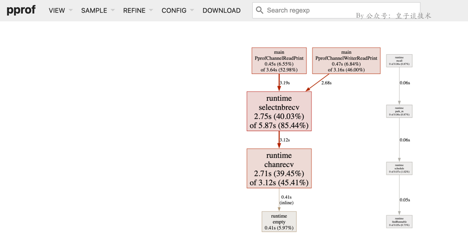

# 测试工具
---

# 一、概述

## （一）单元测试
单元测试指对软件中的最小可测试单元进行检查和验证。可以检查我们的代码能否按照预期进行，代码逻辑是否有问题，以此可以提升代码质量。

简单来说单元测试就是针对某一个函数方法进行测试，我们要先测试正确的传值与获取正确的预期结果，然后再添加更多测试用例，得出多种预期结果。
尽可能达到该方法逻辑没有问题，或者问题都能被我们预知到。这就是单元测试的好处。

## （二）基准测试(压力测试)
基准测试，是一种测试代码执行性能的方式，你可以将多种代码实现进行比对。

## （三）代码覆盖率测试
由单元测试的代码，触发运行到的被测试代码的代码行数占所有代码行数的比例，被称为测试覆盖率，代码覆盖率不一定完全精准，但是可以作为参考，可以帮我们测量和我们预计的覆盖率之间的差距。

# 二、go 标准库 `testing`

[go 标准库 `testing`](https://studygolang.com/pkgdoc)

## （一）`go test` 的使用
### 0. 介绍
在 Go 语言中，可以使用 `go test` 命令来运行单元测试。

**默认情况下，`go test` 会运行所有以 `_test.go` 结尾的测试文件中的测试方法。**

如果您只想运行某个特定的测试方法，可以使用 -run 标志来指定要运行的测试方法的正则表达式。 
只有与该正则表达式匹配的测试方法才会被运行。

以下是一个示例：
```
go test -run TestMyFunction
```


上述命令将运行所有包含 TestMyFunction 的测试方法。
如果您想要更精确地指定要运行的测试方法，可以使用正则表达式的更多功能。
例如，您可以使用 ^ 和 $ 来匹配测试方法的开头和结尾，或者使用 | 来指定多个测试方法。

### 1. 帮助命令
go help test
```
go help test

# `go test` 命令可识别的标志(flag)
- `go test` 命令可识别的标志，并且控制任何测试的执行。包含：
    `-v`、`-run regexp`、`-bench regexp`、`-cover`、`-fuzz`、` -count n`、`-benchtime t`、`-timeout d`、`-cpu 1,2,4`、`-fuzztime t`、`-json`、`-list regexp`、`-coverpkg pattern1,pattern2,pattern3` 等
- `go test` 命令可识别的标志，可用于在执行过程中对测试进行配置：
    `-benchmem`、`-blockprofile block.out`、`-coverprofile cover.out`、`-cpuprofile cpu.out`、`-outputdir directory`、`-trace trace.out`、

```

go help testflag
```
go help testflag

  -test.bench regexp
    	run only benchmarks matching regexp
  -test.benchmem
    	print memory allocations for benchmarks
  -test.benchtime d
    	run each benchmark for duration d (default 1s)
  -test.blockprofile file
    	write a goroutine blocking profile to file
  -test.blockprofilerate rate
    	set blocking profile rate (see runtime.SetBlockProfileRate) (default 1)
  -test.count n
    	run tests and benchmarks n times (default 1)
  -test.coverprofile file
    	write a coverage profile to file
  -test.cpu list
    	comma-separated list of cpu counts to run each test with
  -test.cpuprofile file
    	write a cpu profile to file
  -test.failfast
    	do not start new tests after the first test failure
  -test.fuzz regexp
    	run the fuzz test matching regexp
  -test.fuzzcachedir string
    	directory where interesting fuzzing inputs are stored (for use only by cmd/go)
  -test.fuzzminimizetime value
    	time to spend minimizing a value after finding a failing input (default 1m0s)
  -test.fuzztime value
    	time to spend fuzzing; default is to run indefinitely
  -test.fuzzworker
    	coordinate with the parent process to fuzz random values (for use only by cmd/go)
  -test.list regexp
    	list tests, examples, and benchmarks matching regexp then exit
  -test.memprofile file
    	write an allocation profile to file
  -test.memprofilerate rate
    	set memory allocation profiling rate (see runtime.MemProfileRate)
  -test.mutexprofile string
    	write a mutex contention profile to the named file after execution
  -test.mutexprofilefraction int
    	if >= 0, calls runtime.SetMutexProfileFraction() (default 1)
  -test.outputdir dir
    	write profiles to dir
  -test.paniconexit0
    	panic on call to os.Exit(0)
  -test.parallel n
    	run at most n tests in parallel (default 12)
  -test.run regexp
    	run only tests and examples matching regexp
  -test.short
    	run smaller test suite to save time
  -test.shuffle string
    	randomize the execution order of tests and benchmarks (default "off")
  -test.testlogfile file
    	write test action log to file (for use only by cmd/go)
  -test.timeout d
    	panic test binary after duration d (default 0, timeout disabled)
  -test.trace file
    	write an execution trace to file
  -test.v
    	verbose: print additional output
```

### 2. 命令行 `flag` 语法：
```
-flag
-flag=x
-flag x  // 只有非 bool 类型的 flag 可以
```

可以使用 1 个或 2 个'-'号，效果是一样的。最后一种格式不能用于 bool 类型的 flag，因为如果有文件名为 0、false 等时,如下命令：
```
cmd -x *
```
其含义会改变。你必须使用-flag=false 格式来关闭一个 bool 类型 flag。
Flag 解析在第一个非 flag 参数（单个"-"不是 flag 参数）之前停止，或者在终止符"--"之后停止。

整数 flag 接受 1234、0664、0x1234 等类型，也可以是负数。bool 类型 flag 可以是：
```
1, 0, t, f, T, F, true, false, TRUE, FALSE, True, False
```

### 3. `go test` 常用格式及示例
```
go test [其他 0 个或者多个 flag。如：-v、-bench、-cover、-run 等, 这里的-run 单独放在后面写了] [测试的 go 文件] [依赖的 go 文件] [-run=前缀匹配方法名(`TestXxx` 或者 `TestXxx` 中的 `Xxx` 前缀匹配的方法)或者 `none` 关键字]
```

### 4. 单元测试 `TestXxx` 示例
```
# 测试当前包的所有 `*_test.go` 中的所有单元测试方法
go test

# 测试当前包的所有 `*_test.go` 中的所有单元测试方法,并输出详情
go test -v

# 测试当前包的 `binary_search_test.go` 中的所有单元测试方法
go test -v binary_search_test.go

# 测试当前包的所有 `*_test.go` 中符合 `TestXxx` 或者 `TestXxx` 中的 `Xxx` 前缀匹配的方法。需匹配的前缀推荐写 `TestXxx` 格式
#   需匹配的前缀分别为 `TestBinarySearchV11`、`BinarySearchV11`。 
#   因为 `TestBinarySearchV11` 和 `BinarySearchV11` 的区别在于前面的 `Test`，所以最终匹配后执行的测试方法是一致的
go test -v -run=TestBinarySearchV11
go test -v -run=BinarySearchV11

# 会包含：TestBinarySearchV1、TestBinarySearchV11
go test -v -run=TestBinarySearchV1
go test -v -run=BinarySearchV1

# 不运行任何单元测试，即不运行任何 `TestXxx` 方法
go test -run=none
```

### 5.基准测试 `BenchmarkXxx` 示例
> `go test` 的语法上需加上 `-bench` 的 flag，其他部分跟 ` 单元测试 ` 的使用方法一致

>  如果不使用 `-run` 的 flag 过滤测试方法，默认都是会执行所有的测试方法

> bench 的工作原理
基准测试函数会被一直调用直到 b.N 无效，它是基准测试循环的次数
b.N 从 1 开始，如果基准测试函数在 1 秒内就完成 (默认值)，则 b.N 增加，并再次运行基准测试函数
b.N 的值会按照序列 1,2,5,10,20,50,... 增加，同时再次运行基准测测试函数
上述结果解读代表 1 秒内运行了 279936765 次，每次 4.280 ns
`{基准测试方法}-xx` 的数字后缀(BenchmarkBinarySearchV1-12 中的 12)和用于运行次测试的 GOMAXPROCS 值有关。 与 GOMAXPROCS 一样，此数字默认为启动时 Go 进程可见的 CPU 数。 可以使用-cpu 标识更改此值，可以传入多个值以列表形式来运行基准测试
```
➜  test git:(master) ✗ go test -v -bench=BinarySearchV1 -run=none
goos: darwin
goarch: amd64
pkg: github.com/leeprince/goinfra/test
cpu: Intel(R) Core(TM) i7-8750H CPU @ 2.20GHz
BenchmarkBinarySearchV1
BenchmarkBinarySearchV1-12      279936765                4.280 ns/op
PASS
ok      github.com/leeprince/goinfra/test       1.793s
```


```
# 测试当前包的所有 `*_test.go` 中的所有单元测试 `TestXxx` 方法和基准测试 `BenchmarkXxx` 方法
go test -bench=.

# 测试当前包的所有 `*_test.go` 中的所有基准测试 `BenchmarkXxx` 方法。通过 `-run=none` 忽略所有单元测试 `TestXxx` 方法
go test -bench=. -run=none

# 测试当前包的所有 `*_test.go` 中符合 `BenchmarkXxx` 或者 `BenchmarkXxx` 中的 `Xxx` 前缀匹配的方法。。需匹配的前缀推荐写 `TestXxx` 格式
#   需匹配的前缀分别为 `BenchmarkBinarySearchV1`、`BinarySearchV1`。 
#   因为 `BenchmarkBinarySearchV1` 和 `BinarySearchV1` 的区别在于前面的 `Benchmark`，所以最终匹配后执行的测试方法是一致的
go test -v -bench=BenchmarkBinarySearchV1 -run=none
go test -v -bench=BinarySearchV1 -run=none 

# 会包含：BenchmarkBinarySearchV1、BenchmarkBinarySearchV11
go test -v -bench=BenchmarkBinarySearchV1 -run=none
go test -v -bench=BinarySearchV1 -run=none 

# 打印基准测试的内存分配统计信息
go test -v -bench=BenchmarkBinarySearchV1 -benchmem -run=none

# 使用-cpu 标识更改 go 运行的 cpu 核数
go test -v -bench=BenchmarkBinarySearchV1 -cpu=1,2,4 -run=none

# 因为热缩放、内存局部性、后台处理、gc 活动等等会导致单次的误差，所以一般会进行多次测试
go test -v -bench=BenchmarkBinarySearchV1 -count=3 -run=none

# 有的函数比较慢，为了更精确的结果，可以通过-benchtime 标志指定运行时间，从而使它运行更多次
go test -v -bench=BenchmarkBinarySearchV1 -benchtime=2s -run=none
```

### 1. 单元测试
testing 提供对 Go 包的自动化测试的支持。通过 `go test` 命令，能够自动执行如下形式的任何函数：

func TestXxx(*testing.T)

其中 Xxx 可以是任何字母数字字符串（但第一个字母不能是 [a-z]），用于识别测试例程。

在这些函数中，使用 Error, Fail 或相关方法来发出失败信号。

要编写一个新的测试套件，需要创建一个名称以 _test.go 结尾的文件，该文件包含 `TestXxx` 函数，如上所述。 将该文件放在与被测试的包相同的包中。该文件将被排除在正常的程序包之外，但在运行 “go test” 命令时将被包含。 有关详细信息，请运行 “go help test” 和 “go help testflag” 了解。

如果有需要，可以调用 *T 和 *B 的 Skip 方法，跳过该测试或基准测试：
```
func TestTimeConsuming(t *testing.T) {
   if testing.Short() {
       t.Skip("skipping test in short mode.")
   }
   ...
}
```

### 2. 基准测试
基准测试常用于代码性能测试，函数需要导入 testing 包，并定义以 Benchmark 开头的函数， 参数为 testing.B 指针类型，在测试函数中循环调用函数多次

基准测试主要是通过测试 CPU (`go test -bench=. -cpuprofile`) 和内存 （`go test -bench=. -benchmem`) 的分配，来展示被测试代码的性能，进而找到性能更优的解决方案。

如下形式的函数：
```
func BenchmarkXxx(*testing.B)
```
被认为是基准测试，通过 `go test` 命令，加上 `-bench flag` 来执行。多个基准测试按照顺序运行。

testing flags 的详细描述, 参见 https://github.com/golang/go/blob/master/cmd/go/#hdr-Description_of_testing_flags.

基准测试函数样例看起来如下所示：
```
func BenchmarkHello(b *testing.B) {
   for i := 0; i < b.N; i++ {
       fmt.Sprintf("hello")
   }
}
```

基准函数会运行目标代码 b.N 次。在基准执行期间，会调整 b.N 直到基准测试函数持续足够长的时间。输出
```
BenchmarkHello-12    	261623563	         4.346 ns/op
```

意味着循环执行了 10000000 次，每次循环花费 282 纳秒(ns)。

如果在运行前基准测试需要一些耗时的配置，则可以先重置定时器：
```
func BenchmarkBigLen(b *testing.B) {
   big := NewBig()
   b.ResetTimer()
   for i := 0; i < b.N; i++ {
       big.Len()
   }
}
```

如果基准测试需要在并行设置中测试性能，则可以使用 RunParallel 辅助函数; 这样的基准测试一般与 go test -cpu 标志一起使用：
```
func BenchmarkTemplateParallel(b *testing.B) {
   templ := template.Must(template.New("test").Parse("Hello, {{.}}!"))
   b.RunParallel(func(pb *testing.PB) {
       var buf bytes.Buffer
       for pb.Next() {
           buf.Reset()
           templ.Execute(&buf, "World")
       }
   })
}
```

### 3. 代码覆盖率测试

测试覆盖率（Test Coverage）是指在测试过程中，测试代码覆盖了被测代码的比例。

实际业务中要求方法的测试覆盖率要达到 100%，但是实际中很难达到 100%，所以一般要求达到 95% 以上。
而代码覆盖率是测试覆盖率的一种，是测试代码覆盖了被测代码的比例，通过代码覆盖率可以知道哪些代码没有被测试到，进而可以针对性的进行测试，考虑到很多代码是不可测试的（如：第三方库的代码、依赖的配置文件、if 分支判断的代码等），所以实际业务中很难达到 100% 的测试覆盖率，正常要求60%以上。

```
go test -v -cover

go test -cover -run=<前缀匹配方法名(`TestXxx` 或者 `TestXxx` 中的 `Xxx` 前缀匹配的方法)>
```

go test 工具就为我们提供了一个度量测试覆盖率的能力。
```
go test -cover [-run=<...>] -coverprofile=c.out
```

通过 go tool 来将 c.out 转换成 html 格式的测试覆盖率报告。
```
go tool cover -html=c.out
```

再通过 go tool 来将 c.out 转换成 html 格式的测试覆盖率报告。
```
go tool cover -html=c.out -o=tag.html
```

> 完整步骤
```
# 生成指定 package 的测试覆盖率（fib.out 后面不带参数的，默认是命令所在目录）
$ go test -v -covermode=count -coverprofile fib.out
# 查看汇总的 fib 测试覆盖率
$ go test cover -func=fib.out
# 生成 html
$ go tool cover -html=fib.out -o fib.html
```

### 3. main
测试程序有时需要在测试之前或之后进行额外的设置（setup）或拆卸（teardown）。有时, 测试还需要控制在主线程上运行的代码。为了支持这些和其他一些情况, 如果测试文件包含函数:
```
func TestMain(m *testing.M)
```

那么生成的测试将调用 TestMain(m)，而不是直接运行测试。TestMain 运行在主 goroutine 中, 可以在调用 m.Run 前后做任何设置和拆卸。应该使用 m.Run 的返回值作为参数调用 os.Exit。在调用 TestMain 时, flag.Parse 并没有被调用。所以，如果 TestMain 依赖于 command-line 标志 (包括 testing 包的标记), 则应该显示的调用 flag.Parse。

一个简单的 TestMain 的实现：
```
func TestMain(m *testing.M) {
   // call flag.Parse() here if TestMain uses flags
   // 如果 TestMain 使用了 flags，这里应该加上 flag.Parse()
   
   // m.Run 是调用包下面各个 Test 函数的入口
   os.Exit(m.Run())
}
```


Go 的测试支持在包内优先执行一个 TestMain(m *testing.M) 函数，可以在这里为 package 下所有测试做一些初始化的工作。
```
func TestMain(m *testing.M) {
    ...

    // m.Run 是调用包下面各个 Test 函数的入口
    os.Exit(m.Run())
}
```

# 三、单元测试方法
## （一）简单测试
```
func TestSetReportCallerLogger(t *testing.T) {
	fmt.Println(">>>>> 001")
	plog.Debug("prince log Debug SetReportCaller")
	plog.SetReportCaller(true)
	plog.Debug("prince log Debug SetReportCaller 01")
	plog.WithField("WithField01", "WithFieldValue01").Debug("prince log Debug WithField")
}
```

## （二）表格驱动测试
```
func TestBinarySearchV1(t *testing.T) {
	type args struct {
		arr []int
		v   int
	}
	tests := []struct {
		name string
		args args
		want int
	}{
		{
			name: "",
			args: args{
				arr: []int{1, 3, 5, 7, 9},
				v:   7,
			},
			want: 3,
		},
		{
			name: "",
			args: args{
				arr: []int{1, 3, 5, 7, 9},
				v:   9,
			},
			want: 4,
		},
	}
	for _, tt := range tests {
		t.Run(tt.name, func(t *testing.T) {
			if got := arrayslice.BinarySearchV1(tt.args.arr, tt.args.v); got != tt.want {
				t.Errorf("arrayslice.BinarySearchV1() = %v, want %v", got, tt.want)
			}
		})
	}
}
```

## （三）`github.com/smartystreets/goconvey` - 测试框架

### 1. 断言类型
```
func TestBinarySearchV11(t *testing.T) {
	convey.Convey("测试二分法查找", t, func() {
		convey.So(arrayslice.BinarySearchV1([]int{
			1, 3, 5, 7, 9,
		}, 3), convey.ShouldEqual, 1)
	})
	convey.Convey("测试二分法查找-多个 So", t, func() {
		convey.So(arrayslice.BinarySearchV1([]int{
			1, 3, 5, 7, 9,
		}, 3), convey.ShouldEqual, 1)

		convey.So(arrayslice.BinarySearchV1([]int{
			1, 3, 5, 7, 9,
		}, 3), convey.ShouldEqual, 1)
	})
	convey.Convey("测试二分法查找-嵌套", t, func() {
		convey.Convey("测试二分法查找-嵌套 1", func() {
			convey.So(arrayslice.BinarySearchV1([]int{
				1, 3, 5, 7, 9,
			}, 3), convey.ShouldEqual, 1)
		})
		convey.Convey("测试二分法查找-嵌套 2", func() {
			convey.So(arrayslice.BinarySearchV1([]int{
				1, 3, 5, 7, 9,
			}, 3), convey.ShouldEqual, 1)
		})
	})
}
```

### 2. 断言类型
[断言的 wiki 文档](https://github.com/smartystreets/goconvey/wiki/Assertions)

General Equality
```
So(thing1, ShouldEqual, thing2)
So(thing1, ShouldNotEqual, thing2)
So(thing1, ShouldResemble, thing2)		// a deep equals for arrays, slices, maps, and structs
So(thing1, ShouldNotResemble, thing2)
So(thing1, ShouldPointTo, thing2)
So(thing1, ShouldNotPointTo, thing2)
So(thing1, ShouldBeNil)
So(thing1, ShouldNotBeNil)
So(thing1, ShouldBeTrue)
So(thing1, ShouldBeFalse)
So(thing1, ShouldBeZeroValue)
```

Numeric Quantity comparison
```
So(1, ShouldBeGreaterThan, 0)
So(1, ShouldBeGreaterThanOrEqualTo, 0)
So(1, ShouldBeLessThan, 2)
So(1, ShouldBeLessThanOrEqualTo, 2)
So(1.1, ShouldBeBetween, .8, 1.2)
So(1.1, ShouldNotBeBetween, 2, 3)
So(1.1, ShouldBeBetweenOrEqual, .9, 1.1)
So(1.1, ShouldNotBeBetweenOrEqual, 1000, 2000)
So(1.0, ShouldAlmostEqual, 0.99999999, .0001)   // tolerance is optional; default 0.0000000001
So(1.0, ShouldNotAlmostEqual, 0.9, .0001)
```

Collections
```
So([]int{2, 4, 6}, ShouldContain, 4)
So([]int{2, 4, 6}, ShouldNotContain, 5)
So(4, ShouldBeIn, ...[]int{2, 4, 6})
So(4, ShouldNotBeIn, ...[]int{1, 3, 5})
So([]int{}, ShouldBeEmpty)
So([]int{1}, ShouldNotBeEmpty)
So(map[string]string{"a": "b"}, ShouldContainKey, "a")
So(map[string]string{"a": "b"}, ShouldNotContainKey, "b")
So(map[string]string{"a": "b"}, ShouldNotBeEmpty)
So(map[string]string{}, ShouldBeEmpty)
So(map[string]string{"a": "b"}, ShouldHaveLength, 1) // supports map, slice, chan, and string
```

Strings
```
So("asdf", ShouldStartWith, "as")
So("asdf", ShouldNotStartWith, "df")
So("asdf", ShouldEndWith, "df")
So("asdf", ShouldNotEndWith, "df")
So("asdf", ShouldContainSubstring, "sd")		// optional 'expected occurences' arguments?
So("asdf", ShouldNotContainSubstring, "er")
So("adsf", ShouldBeBlank)
So("asdf", ShouldNotBeBlank)
```

panic
```
So(func(), ShouldPanic)
So(func(), ShouldNotPanic)
So(func(), ShouldPanicWith, "")		// or errors.New("something")
So(func(), ShouldNotPanicWith, "")	// or errors.New("something")
```

Type checking
```
So(1, ShouldHaveSameTypeAs, 0)
So(1, ShouldNotHaveSameTypeAs, "asdf")
```

time.Time (and time.Duration)
```
So(time.Now(), ShouldHappenBefore, time.Now())
So(time.Now(), ShouldHappenOnOrBefore, time.Now())
So(time.Now(), ShouldHappenAfter, time.Now())
So(time.Now(), ShouldHappenOnOrAfter, time.Now())
So(time.Now(), ShouldHappenBetween, time.Now(), time.Now())
So(time.Now(), ShouldHappenOnOrBetween, time.Now(), time.Now())
So(time.Now(), ShouldNotHappenOnOrBetween, time.Now(), time.Now())
So(time.Now(), ShouldHappenWithin, duration, time.Now())
So(time.Now(), ShouldNotHappenWithin, duration, time.Now())
```

# 四、打桩和 mock
## （一）打桩（stub）
桩，或称桩代码，是指用来代替关联代码或者未实现代码的代码。如果函数 B 用 B1 来代替，那么，B 称为原函数，B1 称为桩函数。打桩就是编写或生成桩代码。打桩的目的主要有：隔离、补齐、控制。

- 隔离:隔离的基本方法就是打桩，将测试任务之外的，并且与测试任务相关的代码，用桩来代替，从而实现分离测试任务。例如函数 A 调用了函数 B，函数 B 又调用了函数 C 和 D，如果函数 B 用桩来代替，函数 A 就可以完全割断与函数 C 和 D 的关系。
- 补齐:补齐是指用桩来代替未实现的代码，例如，函数 A 调用了函数 B，而函数 B 由其他程序员编写，且未实现，那么，可以用桩来代替函数 B，使函数 A 能够运行并测试。补齐在并行开发中很常用。
- 控制:控制是指在测试时，人为设定相关代码的行为，使之符合测试需求。例如：

一般来说，桩函数要具有与原函数完全一致的原形，仅仅是实现不同，这样测试代码才能正确链接到桩函数。用于实现隔离和补齐的桩函数一般比较简单，只需把原函数的声明拷过来，加一个空的实现，能通过编译链接就行了。比较复杂的是实现控制功能的桩函数，要根据测试的需要，输出合适的数据

### 1. `github.com/agiledragon/gomonkey` - 打桩框架
> 如果启用了内联，gomonkey 无法修补函数或成员方法，请在禁用内联的情况下运行测试，方法是添加命令行参数 `-gcflags=-l`（go1.10 及以上）或 `-gcflags=all=-l`。
当一个 goroutine 正在修补另一个 gorroutine 同时访问的函数或成员方法时，可能会发生死机。也就是说，gomonkey 不是线程安全的。

> 使用前的一些注意事项：
- gomonkey 框架对于内联的函数会失效（找不到函数入口），测试的时候需要关掉所有的内联，执行 go test -v 时加上参数-gcflags=-l（Go 1.10 以下）或者-gcflags=all=-l（Go1.10 及以上）。
- gomonkey 需要运行在 amd64 架构上。
- gomonkey 不是并发安全的。
- gomonkey 对于私有成员方法的 mock 在 Go 1.7 版本及以上会直接抛出 panic。
一般来说使用 gomonkey 遇到的大多数问题都可以在这四条中找到答案。


引入 gomonkey 有如下好处：
- 隔离被测代码
- 加速执行测试
- 使执行变得确定
- 模拟特殊情况

功能列表
- 支持为一个函数打一个桩
- 支持为一个函数打一个特定的桩序列
- 支持为一个成员方法打一个桩
- 支持为一个成员方法打一个特定的桩序列
- 支持为一个函数变量打一个桩
- 支持为一个函数变量打一个特定的桩序列
- 支持为一个接口打桩
- 支持为一个接口打一个特定的桩序列
- 支持为一个全局变量打一个桩

函数打桩， 对变量的 mock 实现原理跟 `go stub` 一样都是通过 reflect 包实现的。
除了 mock 变量，gomonkey 还可以直接 mock 导出函数/方法、mock 代码所在包的非导出函数

> MacOS 中关于 `Go monkey Permission Denied` 解决方案：https://github.com/eisenxp/macos-golink-wrapper
```
mv $GOROOT/pkg/tool/darwin_amd64/link $GOROOT/pkg/tool/darwin_amd64/original_link
cp https://github.com/eisenxp/macos-golink-wrapper/link $GOROOT/pkg/tool/darwin_amd64/link

# 下载文件，然后再 cp
wget https://raw.githubusercontent.com/eisenxp/macos-golink-wrapper/main/link  
```

## （二）mock
mock 的大致原理是，在编译阶段去确定要调用的对象在 runtime 时需要指向的 mock 类，也就是改变了运行时函数指针的指向。

对于接口 interface 的 mock，我们通过 gomock or mocker 库来帮我们自动生成符合接口的类并产生对应的文件，然后需要通过 gomock or mocker 约定的 API 就能够对 interface 中的函数按我们自己所需要的方式来模拟。

这样，runtime 运行时其实就可以指向 mock 的 interface 实现来满足我们的单测诉求。

## （三）stub VS mock
stub 和 mock 是两种单测中最常见的替身手段，它们都能够用来替换要测试的对象，从而实现对一些复杂依赖的隔离，但是它们在实现和关注点上又有所区别。参考《从头到脚说单测——谈有效的单元测试》一文和 difference-between-stub-and-mock 一文，mock 这里其实是包含了 stub，stub 可以理解为 mock 的子集，mock 更强大一些。如果我们发现自己的代码里面不能使用 mock 必须使用 stub，就是代码设计上肯定有问题，应该及时为'可测试性'做出调整。

Stub：桩的方式。在测试用例中创建一个模拟的方法（函数），用于替换原有自己代码中的方法（函数）
- stub 一般就是在运行时替换了外部依赖返回的结果，并且结果不能调整(成本很高、不容易维护)。
- stub 不需要把外部依赖 interface 化，可以通过运行时函数指针的替换来实现，实现途径很多。
- stub 一般是为一个特定的测试用例来编写特定的桩代码，它是硬编码对应的期望返回数据，很难在其他用例中直接复用

Mock：模拟的方式。在测试用例中创建一个结构体，用例满足某个外部依赖的接口 interface{}
- mock 对象能动态调整外部依赖的返回结果，
- mock 技术一般通过把外部依赖 interface 化来实现，interface 化之后才能做到
- mock 增加了配置手段，可以在不同的测试阶段设置不同的预期值，虽然看起来可能更复杂，但是可复用性更高

在 Go 中，如果要用 stub，其实是是侵入式的。因为我们必须将我们的代码设计成可以用 stub 方法替换的形式。所以，相对来说，mock 的使用会更广泛。

当然，另外一种思路就是将 Mock 和 Stub 结合使用，比如，可以在 mock 对象的内部放置一个可以被测试函数 stub 替换的函数变量，我们可以在我们的测试函数中，根据测试的需要，手动更换函数实现。

### 1. Go 常见的 mock 库
Go 官方有一个 `github.com/golang/mock/gomock` 和 `https://github.com/travisjeffery/mocker`，但是只能模拟 interface 方法，这就要求我们业务编写代码的时候具有非常好的接口设计，这样才能顺利生成 mock 代码。

# 五、http 测试
## （一）go 标准库 `net/http/httptest`

# 六、数据库测试

## （一）`github.com/DATA-DOG/go-sqlmock`


# 七、压力测试
## 基准测试 与 压力测试 的作用与区别
基准测试和压力测试是性能测试的两种不同类型，它们各自有着不同的目的和应用场景：

> 基准测试（Benchmarking）

作用：
- 性能评估： 用于评估代码、算法或系统在特定条件下的性能。
- 性能比较： 用于比较不同实现之间的性能差异，确定哪种方法更高效。
- 优化代码： 可帮助发现代码中的性能瓶颈，找到优化空间并改进性能。

应用场景：
- 算法优化： 在改进算法或数据结构时，使用基准测试来评估不同实现的性能。
- 库和框架性能比较： 对于不同库或框架的性能对比，选择最适合的工具。
- 新特性评估： 对新特性或改进进行评估，确认是否带来性能提升。

> 压力测试（Stress Testing）

作用：
- 系统稳定性： 评估系统在极限负载下的稳定性和鲁棒性。
- 资源耗尽： 模拟大规模负载以验证系统在处理大量请求时的表现，包括资源消耗、内存泄漏等问题。

应用场景：
- 服务器负载测试： 测试服务器在高负载时的表现，包括处理请求的能力、资源消耗等。
- 并发性能测试： 测试系统在同时处理多个请求时的性能表现，验证其在高并发情况下的稳定性。
- 缓存或数据库测试： 对缓存或数据库在高负载下的表现进行评估，验证其处理能力和稳定性。

不同之处：
- 目的不同： 基准测试旨在评估代码或算法在**标准条件**下的性能，而压力测试则旨在测试系统在**高负载或极限条件**下的稳定性和表现。
- 应用场景不同： 基准测试通常用于评估和改进代码、算法等实现，而压力测试主要用于验证系统在负载增加时的行为和稳定性。

在实际应用中，这两种测试通常结合使用，帮助开发者全面了解系统、算法或代码的性能特征，从而优化和改进系统。

## 性能分析

### （一）性能分析 pprof
pprof是golang内置的性能分析工具，在进行性能问题分析(入内存泄露，goroutine泄露,cpu资源占用较高等分析)时使用，其可成为我们进行golang开发时，调试应用性能的常用工具。 

#### 简介
profile在计算机领域，我们可以将其理解为当前应用程序运行状态的画像。当程序性能不佳时，我们希望知道应用在 什么地方耗费了多少 CPU、memory等资源，golang是非常注重性能的语言，其内置的pprof就是为了分析调优程序运行性能而生。

pprof主要模块介绍：
- CPU profile：当前程序的CPU使用情况，pprof按照一定频率去采集应用程序在CPU和寄存器上面的数据
- Memory Profile（Heap Profile）：当前程序的内存使用情况，可查看heap和alloc的情况
- Block Profiling：程序当前goroutines不在运行状态的情况，可以用来分析和查找死锁等性能瓶颈
- Goroutine Profiling：程序当前goroutines的使用情况，查看所有goroutine，产看调用关系，可发现未释放的go程

#### pprof 引入方式
pprof引入代码有两种方式，
- runtime/pprof：一种是项目中导入runtime/pprof,主要用来产生dump文件，然后再使用 Go Tool PProf 来分析这运行日志，此种方式在普通的单机程序未使用http网络服务上使用。
- pkg/profile：runtime/pprof使用起来有些不便，因为要重复编写打开文件，开启分析，结束分析的代码。所以出现了包装了runtime/pprof的库：pkg/profile。
- net/http/pprof：另一种方式是项目中导入net/http/pprof,net/http/pprof是对runtime/pprof的封装，如果当前程序已启用http服务，使用此种方式非常方便，以做到直接在web上看到当前 web 服务的状态，包括 CPU 占用情况和内存使用情况等

##### 1、项目中导入runtime/pprof

添加启动分析CPU、内存
```
import (
	"flag"
	"fmt"
	"os"
	"runtime/pprof"
	"strings"
	"time"
)
// --- pprof 性能分析
var isCpuPprof bool
var isMemPprof bool
flag.BoolVar(&isCpuPprof, "cpu", false, "是否开启cpu测试")
flag.BoolVar(&isMemPprof, "mem", false, "是否开启内存测试")
flag.Parse()

if isCpuPprof {
    fmt.Println("开启cpu测试")
    file, err := os.Create("cpu.pprof")
    if err != nil {
        fmt.Println("create cpu.pprof file error:", err)
    }
    defer file.Close()
    pprof.StartCPUProfile(file)
    defer pprof.StopCPUProfile()
} else {
    fmt.Println("不开启cpu测试")
}

if isMemPprof {
    fmt.Println("开启内存测试")
    file, err := os.Create("mem.pprof")
    if err != nil {
        fmt.Println("create mem.pprof file error:", err)
    }
    defer file.Close()
    pprof.WriteHeapProfile(file)
    defer pprof.StopCPUProfile()
} else {
    fmt.Println("不开启内存测试")
}
fmt.Println("> 业务逻辑运行入口 开始运行")
// ... 业务逻辑运行入口
fmt.Println("> 业务逻辑运行入口 运行结束")
time.Sleep(time.Second * 1)
```
查看分析报告如果使用runtime/pprof的导入方式，则只能通过如下方式进行查看。
```
go tool pprof <cpu.pprof报告文件自定义文件名/扩展名>


--- 会进入命令终端
进入后可以通过输入help查看帮助；或者"help <cmd|option>" 查看具体命令帮助

常用的命令
整体运行状态：top
整体运行状态前10：top10
具体函数分析：list <函数名>
通过web端查看：web

---
```

go tool pprof ...参数解释：
- flat：指的是该方法所占用的CPU时间（不包含这个方法中调用其他方法所占用的时间）
- flat%: 指的是该方法flat时间占全部采样时间的比例
- cum：指的是该方法以及方法中调用其他方法所占用的CPU时间总和，这里注意区别于flat
- cum%:指的是该方法cum时间占全部采样时间的比例
- sum%: 指的是执行到当前方法累积占用的CPU时间总和，也即是前面flat%总和

**火焰图**
通过命令行查看 CPU 或内存情况不够直观。Bredan Gregg 大神发明了火焰图（Flame Graph）可以很直观地看到内存和 CPU 消耗情况。
新版本的 go tool pprof 工具已经集成了火焰图（我使用的是 Go1.20 已经集成）。旧版本想要生成火焰图，必须安装 graphviz。

在 Mac 上：
```
brew install graphviz
```

在 Ubuntu 上：
```
apt install graphviz
```

在 Windows 上，官网下载页http://www.graphviz.org/download/有可执行安装文件，下载安装即可。注意设置 PATH 路径。

上面程序生成的 cpu.profile 和 mem.profile 我们可以直接在网页上查看火焰图。执行下面命令：

```
go tool pprof -http :8080 <本地cpu.profile文件，或者远程profile文件https://ip:port/debug/pprof/profile>
```

默认会打开浏览器窗口，我们可以在 VIEW 菜单栏中切换显示火焰图：


可以用鼠标在火焰图上悬停、点击，来查看具体的某个调用。


#### 2、项目中导入pkg/profile
runtime/pprof使用起来有些不便，因为要重复编写打开文件，开启分析，结束分析的代码。所以出现了包装了runtime/pprof的库：pkg/profile。pkg/profile的 GitHub 仓库地址为：https://github.com/pkg/profile。pkg/profile只是对runtime/pprof做了一层封装，让它更好用。使用pkg/profile可以将代码简化为一行。使用前需要使用go get github.com/pkg/profile获取这个库。

默认启用的是 CPU profiling
```
defer profile.Start().Stop()
```

如果要启用 Memory profiling，可以传入函数选项MemProfile：
```
defer profile.Start(profile.MemProfile).Stop()
```

另外还可以通过函数选项控制内存采样率，默认为 4096。我们可以改为 1：
```
defer profile.Start(profile.MemProfile, profile.MemProfileRate(1)).Stop()
```

#### 3、项目中导入net/http/pprof
```
//再main包中加入
import _ "net/http/pprof"
```

其调用pprof的init函数如下：
```
//pprof.go
func init() {
 http.HandleFunc("/debug/pprof/", Index)
 http.HandleFunc("/debug/pprof/cmdline", Cmdline)
 http.HandleFunc("/debug/pprof/profile", Profile)
 http.HandleFunc("/debug/pprof/symbol", Symbol)
 http.HandleFunc("/debug/pprof/trace", Trace)
}
```
可以看到其把相关的路由加到DefaultServeMux路由器中了，如果我们程序开启了http服务，并使用HTTP默认路由分发器DefaultServeMux，则只需要再main包中导入import _ "net/http/pprof",即可通过"http://ip:port/debug/pprof"进行pprof接口访问，如果程序未开启使用默认路由器的http服务，可再main函数中开启一个httpserver即可，如下例子：
```
package main

import (
    "log"
    "net/http"
    _ "net/http/pprof"
)

func main() {
    go func() {
        http.ListenAndServe("0.0.0.0:9009", nil)//开启一个http服务，nil表示绑定默认路由器DefaultServeMux
    }()
  // ... rest of the program ...
}

```

如果程序开启了http服务器，并自定义了路由器ServeMux，则只需要把pprof相关的路径加入到自定义的ServeMux中即可，不需要单独开启http服务：
```
r := http.NewServeMux()
r.HandleFunc("/debug/pprof/", pprof.Index)
r.HandleFunc("/debug/pprof/cmdline", pprof.Cmdline)
r.HandleFunc("/debug/pprof/profile", pprof.Profile)
r.HandleFunc("/debug/pprof/symbol", pprof.Symbol)
r.HandleFunc("/debug/pprof/trace", pprof.Trace)
http.ListenAndServe("0.0.0.0:9009", r)//程序业务的httpserver，自定义了mux，需要把pprof的路径加进去ike
```


## wrk

### （一）命令
```
$ wrk --help
Usage: wrk <options> <url>                            
  Options:                                            
    -c, --connections <N>  Connections to keep open   
    -d, --duration    <T>  Duration of test           
    -t, --threads     <N>  Number of threads to use   
                                                      
    -s, --script      <S>  Load Lua script file       
    -H, --header      <H>  Add header to request      
        --latency          Print latency statistics   
        --timeout     <T>  Socket/request timeout     
    -v, --version          Print version details      
                                                      
  Numeric arguments may include a SI unit (1k, 1M, 1G)
  Time arguments may include a time unit (2s, 2m, 2h)
  
  使用方法: wrk <选项> <被测 HTTP 服务的 URL>                            
  Options:                                            
    -c, --connections <N>  跟服务器建立并保持的 TCP 连接数量  
    -d, --duration    <T>  压测时间           
    -t, --threads     <N>  使用多少个线程进行压测   
                                                      
    -s, --script      <S>  指定 Lua 脚本路径       
    -H, --header      <H>  为每一个 HTTP 请求添加 HTTP 头      
        --latency          在压测结束后，打印延迟统计信息   
        --timeout     <T>  超时时间     
    -v, --version          打印正在使用的 wrk 的详细版本信息
                                                      
  <N>代表数字参数，支持国际单位 (1k, 1M, 1G)
  <T>代表时间参数，支持时间单位 (2s, 2m, 2h)

```

### （二）关于线程数
PS: 关于线程数，并不是设置的越大，压测效果越好，线程设置过大，反而会导致线程切换过于频繁，效果降低，一般来说，推荐设置成压测机器 CPU 核心数的 2 倍到 4 倍就行了。

### （三）结果说明
```
Running 30s test @ http://www.baidu.com （压测时间 30s）
  12 threads and 400 connections （共 12 个测试线程，400 个连接）
              （平均值） （标准差）  （最大值）（正负一个标准差所占比例）
  Thread Stats   Avg      Stdev     Max   +/- Stdev
    （延迟）
    Latency   386.32ms  380.75ms   2.00s    86.66%
    (每秒请求数)
    Req/Sec    17.06     13.91   252.00     87.89%
  Latency Distribution （延迟分布）
     50%  218.31ms
     75%  520.60ms
     90%  955.08ms
     99%    1.93s 
  4922 requests in 30.06s, 73.86MB read (30.06s 内处理了 4922 个请求，耗费流量 73.86MB)
  Socket errors: connect 0, read 0, write 0, timeout 311 (发生错误数)
Requests/sec:    163.76 (QPS 163.76,即平均每秒处理请求数为 163.76)
Transfer/sec:      2.46MB (平均每秒流量 2.46MB)
```

### （四）关于使用 lua 脚本
#### 1. lua 版本

wrk 默认使用的是 lua 5.1 版本，不过当前版本（2023-10-31）已经到了：lua-5.4.6.tar.gz
```
curl -R -O http://www.lua.org/ftp/lua-5.1.5.tar.gz
tar zxf lua-5.1.5.tar.gz
cd lua-5.1.5
make all test

# 说明： 如果 mak all test 报错：可以尝试：make linux test,再执行：make install

```

#### 2. lua 插件管理 luarocks

1）Ubuntu中安装：
```
sudo apt-get install luarocks
```

2）在CentOS中安装LuaRocks的命令为：
```
sudo yum install luarocks
```

安装LuaRocks后，你就可以使用它来安装cjson模块了。

3）源码安装
> 如：Alpine Linux 3.8（Kernel）

如果你的环境中不能安装LuaRocks，你也可以尝试从源代码编译cjson。首先，从cjson的GitHub仓库下载源代码，然后按照README文件中的指示进行编译和安装。
请注意，编译cjson可能需要一些依赖库，如gcc和make。如果你的环境中没有这些库，你需要先安装它们。
```
wget --no-check-certificate https://luarocks.org/releases/luarocks-3.9.2.tar.gz
tar zxpf luarocks-3.9.2.tar.gz
cd luarocks-3.9.2
./configure
make && make install
```

a. 报错：certificate has expired
```
/data/wrk # wget https://luarocks.org/releases/luarocks-3.9.2.tar.gz
Connecting to luarocks.org (45.33.61.132:443)
ssl_client: luarocks.org: certificate verification failed: certificate has expired
```
解决：
```
wget --no-check-certificate https://luarocks.org/releases/luarocks-3.9.2.tar.gz
```

b. 执行 `./configure` 报错：Lua interpreter not found in $PATH
原环境中并没有：lua 环境

解决：
```
# 更新你的包列表
apk update

# 然后，安装必要的依赖：
apk add lua5.1 lua5.1-dev gcc make libc-dev

apk add lua5.4 lua5.4-dev gcc make libc-dev
```


c. 执行 `apk update` 报错：ERROR: http://dl-cdn.alpinelinux.org/alpine/v3.8/main: Bad file descriptor
解决：更换源
```
mv /etc/apk/repositories /etc/apk/repositories.bak
vi /etc/apk/repositories
```
注释掉
```text
http://dl-cdn.alpinelinux.org/alpine/v3.8/main
http://dl-cdn.alpinelinux.org/alpine/v3.8/community
```
添加阿里云镜像
```
# http://dl-cdn.alpinelinux.org/alpine/v3.8/main
# http://dl-cdn.alpinelinux.org/alpine/v3.8/community

http://mirrors.aliyun.com/alpine/v3.8/main
http://mirrors.aliyun.com/alpine/v3.8/community
```


d. 执行 `apk update` 报错：WARNING: Ignoring APKINDEX.e3d33561.tar.gz: Bad file descriptor
```
# 如果路径存在，则清除缓存
rm -rf /var/cache/apk/*

# 如果路径不存在则创建
mkdir -p /var/cache/apk/

再次尝试执行apk update命令
```
如果还有问题，直接使用 `--no-cache` 选项来执行 `apk update` 命令。这个选项会让 apk 直接从软件源下载软件包，而不使用缓存：
```
apk --no-cache update

# 最后在执行一次
apk update
```

#### 3. 通过 luarocks 安装 luasocket 模块，模块名为：`socket`
```
sudo luarocks install luasocket
```

测试 `socket` 模块是否能成功引入
```
$ lua
Lua 5.1.1 Copyright (C) 1994-2018 Lua.org, PUC-Rio
> require "socket"
```

luarocks install luasocket 可能安装成功了，但是 lua 脚本找不到 socket 模块，所以会报错。
解决：
1. 这是确定 socket 安装的时候安装的路径(~/prince.lee/luarocks-3.9.2/lua_modules/lib/5.1)；
2. 创建软连接到报错时会查找路径（/usr/local/lib/lua）下：sudo ln -s ~/prince.lee/luarocks-3.9.2/lua_modules/lib/5.1 /usr/local/lib/5.1


#### 4. 通过 luarocks 安装 luasocket 模块，模块名为：`cjson`
cjson 是一个用于 Lua 的快速 JSON 编码/解码库。

你可以通过 LuaRocks（Lua的包管理器）来安装 cjson 模块。在命令行中输入以下命令：
```
luarocks install lua-cjson
```

报错：
```
/usr/local/luarocks-3.9.2 # luarocks install lua-cjson
Warning: Failed searching manifest: Failed downloading https://luarocks.org/manifest-5.1 - failed downloading https://luarocks.org/manifest-5.1
Warning: Failed searching manifest: Failed downloading https://raw.githubusercontent.com/rocks-moonscript-org/moonrocks-mirror/master/manifest-5.1 - failed downloading https://raw.githubusercontent.com/rocks-moonscript-org/moonrocks-mirror/master/manifest-5.1
Warning: Failed searching manifest: Failed downloading https://luafr.org/luarocks/manifest-5.1 - failed downloading https://luafr.org/luarocks/manifest-5.1

Error: No results matching query were found for Lua 5.1.
To check if it is available for other Lua versions, use --check-lua-versions.
```
解决：
> 参考链接：https://github.com/luarocks/luarocks/issues/952
```
# 就是这么神奇，因为 wget 实际上我上面已经使用过了，不过问题的发生实际上是跟 wget 的版本有关系的
apk add wget
```


### （五）windows 使用 wrk
#### 1. 问题
wrk 支持 mac 和 linux，不支持 windows

解决与使用
使用 docker

拉取镜像:该镜像为一次性镜像，无法挂起，容器运行即停。

因为每次都需要构建这个一次性容器，有点浪费时间
```
docker pull williamyeh/wrk
```

开始压测
```
docker run -e MYSQL_ROOT_PASSWORD=xxx --rm -v `pwd`:/data williamyeh/wrk -c 300 -t 2 -d 5 http://localhost:19999/ping
```

#### 使用构建好的镜像
Dockerfile 文件：Dockerfile-wrk
重新构建好的并发布的镜像：leeprince/wrk

运行容器
```
docker run -d -v .\performancetest\:/data --name wrk leeprince/wrk
```

进入容器
```
docker exec -it wrk bash
```

### （六）wrk 测试文件
> ./performancetest/wrk/*


